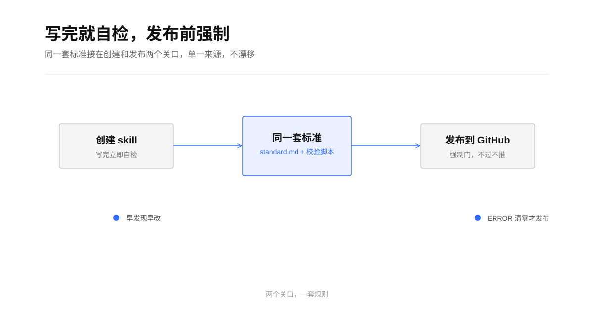
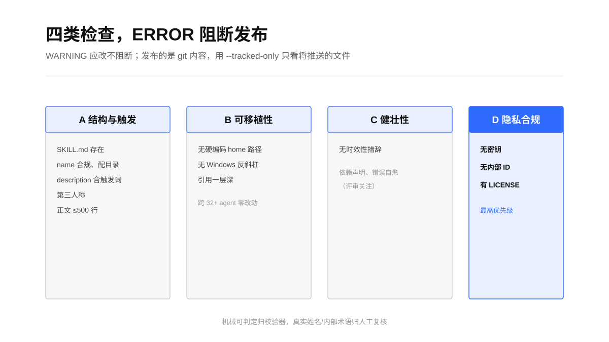
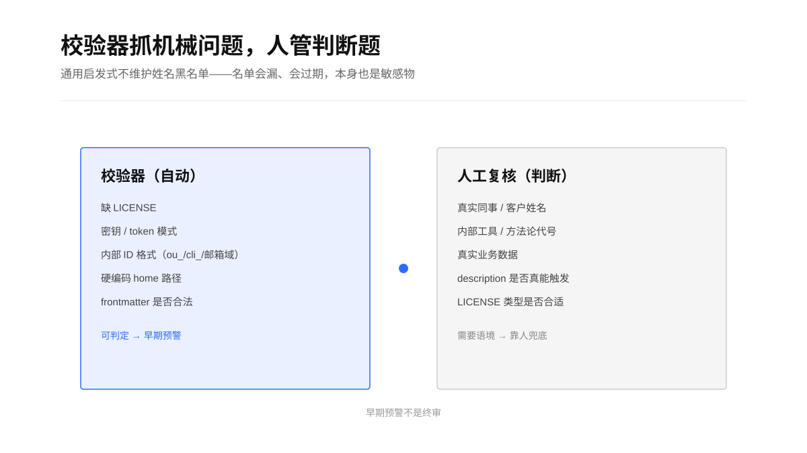

<h1 align="center">Skill 开源就绪检查 · skill-release-check</h1>

<p align="center">
  <a href="https://github.com/TongyiDai/skill-release-check/actions/workflows/ci.yml"></a>
  
  
  =3.8">
  
  
</p>

> "If I have seen further it is by standing on the shoulders of Giants." — Isaac Newton

一个 agent-agnostic 的检查器：在把 Agent Skill 公开开源前，判断它是否**能被正确触发、跨 agent 可移植、健壮、且不泄露隐私或缺失许可证**。标准即代码——一份可读标准（[references/standard.md](references/standard.md)）配一个零依赖校验脚本，两端共用。

## 为什么需要它

Skill 写得对不对，和"能不能安全开源"是两件事。真实审计里反复出现的开源事故是同一批：缺 LICENSE、示例里带真实同事姓名或内部工具名、脚本写死了某台机器的 `/Users/...` 路径。这些问题在发布那一刻才发现就要返工——本工具把标准提前到「创建时自检」和「发布时强制门」两个关口，单一来源，不漂移。

<p align="center">
  
</p>

## 快速使用

纯 Python 3.8+ 标准库，无需安装任何依赖：

```bash
# 检查一个 skill 目录
python3 scripts/check_skill_readiness.py <skill-dir>

# 发布门：只看将被 push 的 git 内容，输出机器可读报告
python3 scripts/check_skill_readiness.py <skill-dir> --tracked-only --json
```

退出码 `0` 表示无 ERROR（可发布），`1` 表示有 ERROR（阻断）。`--strict` 把 WARNING 也当失败。

## 检查什么

| 类别 | ERROR（阻断） | WARNING（应改） |
|---|---|---|
| A 结构与触发 | 缺 SKILL.md / frontmatter / name / description，命名违规，含保留词 | name 与目录不一致、description 无触发词或非第三人称、正文 >500 行 |
| B 可移植性 | 硬编码 per-user home 路径 | Windows 反斜杠路径、引用嵌套 >1 层 |
| C 健壮性 | — | 时效性措辞（会过期的日期表述） |
| D 隐私与合规 | 密钥模式、内部标识符（`ou_`/`cli_`/企业邮箱域…）、缺 LICENSE | — |

完整规则与依据见 [references/standard.md](references/standard.md)。

<p align="center">
  
</p>

## 边界

校验器抓机械可判定的问题，是早期预警不是终审。**真实姓名、内部代号、真实业务数据**用通用启发式无法可靠识别，发布前必须人工复核示例与 references；`description` 能否真正触发建议用 20 条查询自测。工具只用通用启发式，不维护姓名黑名单——名单会漏、会过期，本身也是敏感物。

<p align="center">
  
</p>

## 结构

```text
skill-release-check/
├── SKILL.md                          # skill 主说明与工作流
├── agents/openai.yaml                # Codex 展示信息
├── assets/boards/                    # README 用的 Geometry Blue 画板
├── references/standard.md            # 开源就绪标准（规则 + 依据）
└── scripts/check_skill_readiness.py  # 零依赖校验器
```

## 许可

本项目以 MIT 许可开源，详见 [LICENSE](LICENSE)。
